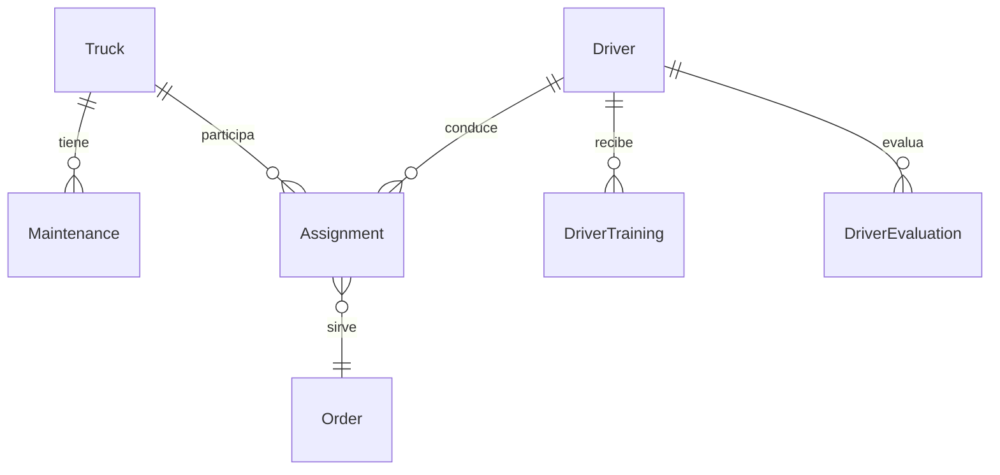

# Módulo de gestión de flota y choferes

Este documento resume la arquitectura funcional del módulo logístico incorporado al proyecto.

## 1. Gestión de flota y choferes

### Camiones
- **Modelo:** `App\Models\Truck` con métricas de mantenimiento (`maintenance_interval_days`, `maintenance_mileage_threshold`, `last_maintenance_mileage`).
- **Componentes Livewire:**
  - `TruckList` (`app/Livewire/Fleet/TruckList.php` – vista `resources/views/livewire/fleet/truck-list.blade.php`) con filtros, alertas por kilometraje y control de mantenimientos pendientes.
  - `MaintenanceForm` y `MaintenanceList` para registrar servicios con lectura de odómetro.
- **Validaciones clave:** impedimos asignar camiones en mantenimiento o con alertas críticas mediante `Truck::requiresMaintenanceAlert()`.

### Choferes
- **Modelo:** `App\Models\Driver` con relaciones a horarios, evaluaciones y capacitaciones (`DriverTraining`).
- **Componentes:**
  - `DriverForm` permite administrar datos personales, horarios dinámicos, capacitaciones y evaluaciones con validaciones en vivo.
  - `DriverList` muestra métricas de disponibilidad, licencias y formaciones vigentes.
- **Validaciones:** el formulario obliga a licencias vigentes, capacitaciones y evita solapamiento de horarios durante asignaciones.

## 2. Historial de mantenimiento
- **Modelo:** `App\Models\Maintenance` (campo nuevo `odometer`).
- **Formulario:** registra tipo, fecha, costo, lectura de odómetro y estado del servicio. Al completar se actualiza el kilometraje y la fecha del siguiente mantenimiento del camión.
- **Alertas:** `TruckList` destaca unidades con mantenimientos vencidos o próximos (por fecha o kilometraje).

## 3. Control de disponibilidad en vivo
- **Componente:** `AvailabilityBoard` (`app/Livewire/Fleet/AvailabilityBoard.php`, vista en `resources/views/livewire/fleet/availability-board.blade.php`).
- **Características:**
  - Actualización automática (`wire:poll`) cada 20s.
  - Resumen de estados de camiones y choferes.
  - Filtros rápidos por estado y búsquedas por placa o nombre.

## 4. Asignación de recursos
- **Componente:** `AssignmentForm` con modos manual/automático.
  - Bloquea asignaciones con licencias vencidas, choferes ocupados, camiones en mantenimiento o con alertas por kilometraje/tiempo.
  - El modo automático busca la mejor combinación disponible y notifica si no hay recursos.
- **Listados:** `AssignmentList` mantiene filtros combinados y liberación de recursos al eliminar asignaciones.

## 5. Reportes y exportaciones
- **Componente:** `Fleet\Report` genera métricas completas y permite exportar a PDF/Excel.
- **Dependencias sugeridas:** `barryvdh/laravel-dompdf` y `maatwebsite/excel`. Si no están instaladas, se informa al usuario.
- **Vista de exportación:** `resources/views/exports/fleet/report.blade.php` reutilizada para ambos formatos.

## 6. Seguridad y usabilidad
- Autorizaciones basadas en `App\Enums\UserRole` y políticas existentes.
- Formularios Livewire con validaciones en tiempo real y mensajes contextualizados.
- Semillas y fábricas (`database/factories`) permiten poblar datos para QA masiva.

## 7. Diagramas (Mermaid)



## 8. Pasos para pruebas
1. Ejecutar migraciones (`php artisan migrate`).
2. Sembrar datos (`php artisan db:seed`).
3. Correr pruebas (`php artisan test --filter=AssignmentFormTest`).

## 9. Recomendaciones de instalación de exportadores
```
composer require barryvdh/laravel-dompdf maatwebsite/excel
php artisan vendor:publish --provider="Barryvdh\DomPDF\ServiceProvider"
php artisan vendor:publish --provider="Maatwebsite\Excel\ExcelServiceProvider"
```

Con estas mejoras se garantiza trazabilidad, disponibilidad y escalabilidad para la operación logística.
